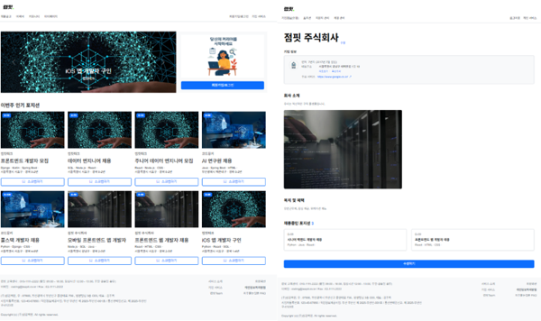
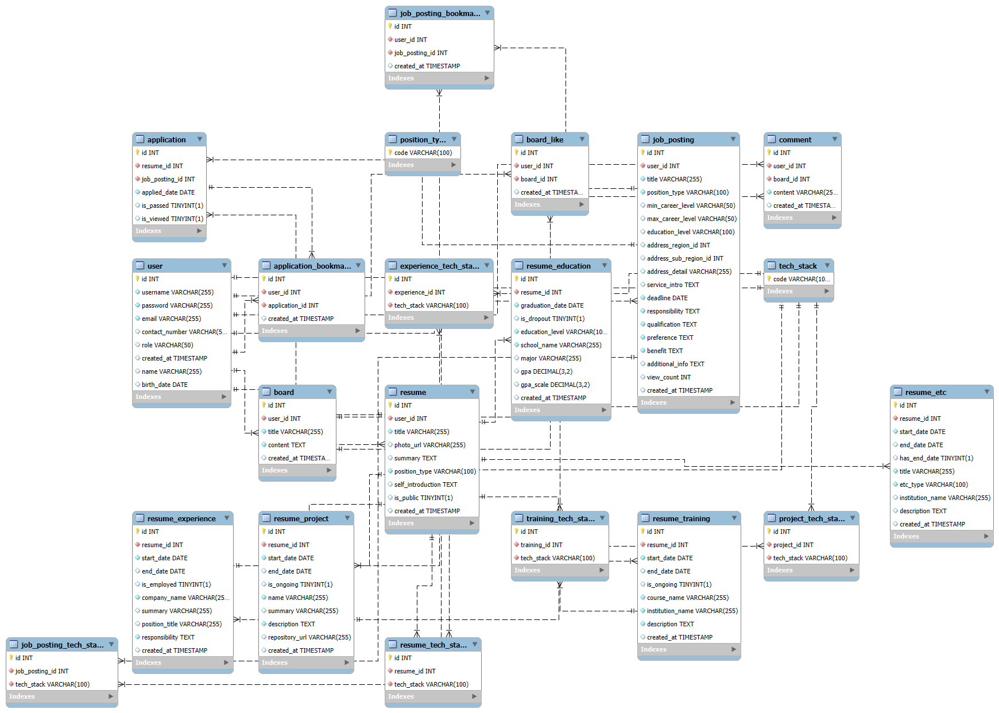

# 스프링 부트 미니프로젝트1 - 휴먼클라우드 웹


## 스프링 부트 휴먼클라우드 웹 프로젝트 시연영상

### 개인 & 기업

[](https://www.notion.so/getinthere/1d58a08b6c0d810e904dfacc6574712c?pvs=4#1e78a08b6c0d8007b60bd09358cb48ae)

https://www.notion.so/getinthere/1d58a08b6c0d810e904dfacc6574712c?pvs=4#1e78a08b6c0d8007b60bd09358cb48ae

## 🛠️기술스택

### 💻Backend

 
 

### 🌐Frontend


### 🛢DataBase


### ☁ 협업 도구

 


## 기획 (완료)

## 화면 설계 (완료)

## 테이블 설계 (완료)

## 1단계 기능

- 특징: JavaScript, Exception
- 메인 화면 (기업/개인)
- 회원가입 (기업/개인)
- 로그인
- 로그아웃
- 회원정보 수정 (기업/개인)

### <개인>

- 직무별 공고 보기/상세보기
- 기술스택별 공고 보기/상세보기
- 경력별 공고 보기/상세보기
- 지역(시)별 공고 보기/상세보기
- 지역(군/구)별 공고 보기/상세보기
- 최신순 공고 보기/상세보기
- 인기순 공고 보기/상세보기
- 공고 지원하기
- 이력서 관리 (상세보기,수정,삭제)
- 이력서 등록
- 마이페이지 (지원내역, 스크랩 공고) 보기

### <기업>

- 기업정보 상세보기
- 기업정보 수정하기
- 채용포지션 목록 보기
- 채용포지션 등록하기
- 지원자 목록 보기
- 지원자 상세보기

## 2단계 기능

- username 중복 체크 (Ajax)
- 채용공고 스크랩, 지원자 이력서 스크랩, 게시글 좋아요 (Ajax)
- 이력서 사진, 기업 로고 사진, 기업 대표이미지 사진 등록 (파일등록)

## 3단계 기능

- Interceptor
- 유효성 검사 자동화

## 테이블 쿼리



```sql
==========================
✅ 1. Independent Tables
==========================

CREATE TABLE user_tb
(
    id             INT AUTO_INCREMENT PRIMARY KEY,
    birth_date     DATE,
    created_at     TIMESTAMP(6),
    contact_number VARCHAR(255) NOT NULL,
    email          VARCHAR(255) NOT NULL,
    name           VARCHAR(255),
    password       VARCHAR(255) NOT NULL,
    username       VARCHAR(255) NOT NULL UNIQUE,
    role           ENUM('company','personal') NOT NULL
);

CREATE TABLE position_type_tb
(
    code VARCHAR(255) PRIMARY KEY
);

CREATE TABLE tech_stack_tb
(
    code VARCHAR(255) PRIMARY KEY
);

CREATE TABLE region_tb
(
    id   INT AUTO_INCREMENT PRIMARY KEY,
    name VARCHAR(255) NOT NULL
);

===========================
✅ 2. Sub-region & Resume
===========================

CREATE TABLE sub_region_tb
(
    id        INT AUTO_INCREMENT PRIMARY KEY,
    region_id INT,
    name      VARCHAR(255) NOT NULL,
    FOREIGN KEY (region_id) REFERENCES region_tb (id)
);

CREATE TABLE resume_tb
(
    id                INT AUTO_INCREMENT PRIMARY KEY,
    is_public         BOOLEAN      NOT NULL,
    user_id           INT,
    created_at        TIMESTAMP(6),
    updated_at        TIMESTAMP(6),
    photo_url         VARCHAR(255),
    position_type     VARCHAR(255) NOT NULL,
    title             VARCHAR(255) NOT NULL,
    self_introduction TEXT,
    summary           TEXT,
    FOREIGN KEY (user_id) REFERENCES user_tb (id)
);

==================================
✅ 3. Job Posting & Company Info
=================================

CREATE TABLE company_info_tb
(
    id                 INT AUTO_INCREMENT PRIMARY KEY,
    user_id            INT,
    establishment_date DATE,
    address            VARCHAR(255) NOT NULL,
    company_name       VARCHAR(255) NOT NULL,
    image              VARCHAR(255) NOT NULL,
    logo_image         VARCHAR(255),
    benefit            TEXT,
    introduction       TEXT,
    main_service       TEXT,
    FOREIGN KEY (user_id) REFERENCES user_tb (id)
);

CREATE TABLE job_posting_tb
(
    id                    INT AUTO_INCREMENT PRIMARY KEY,
    address_region_id     INT,
    address_sub_region_id INT,
    deadline              DATE         NOT NULL,
    max_career_level      INT,
    min_career_level      INT,
    user_id               INT          NOT NULL,
    view_count            INT          NOT NULL DEFAULT 0,
    created_at            TIMESTAMP(6),
    address_detail        VARCHAR(255),
    education_level       VARCHAR(255),
    position_type         VARCHAR(255) NOT NULL,
    title                 VARCHAR(255) NOT NULL,
    additional_info       TEXT,
    benefit               TEXT,
    preference            TEXT,
    qualification         TEXT         NOT NULL,
    responsibility        TEXT         NOT NULL,
    service_intro         TEXT,
    FOREIGN KEY (user_id) REFERENCES user_tb (id)
);

==============================
✅ 4. Application & Bookmark
==============================

CREATE TABLE application_tb
(
    id             INT AUTO_INCREMENT PRIMARY KEY,
    applied_date   DATE,
    is_passed      BOOLEAN,
    is_viewed      BOOLEAN,
    job_posting_id INT,
    resume_id      INT,
    FOREIGN KEY (job_posting_id) REFERENCES job_posting_tb (id),
    FOREIGN KEY (resume_id) REFERENCES resume_tb (id)
);

CREATE TABLE application_bookmark_tb
(
    id             INT AUTO_INCREMENT PRIMARY KEY,
    application_id INT,
    user_id        INT,
    created_at     TIMESTAMP(6),
    FOREIGN KEY (application_id) REFERENCES application_tb (id),
    FOREIGN KEY (user_id) REFERENCES user_tb (id)
);

===========================
✅ 5. Resume Sub-sections
===========================

CREATE TABLE education_tb
(
    id              INT AUTO_INCREMENT PRIMARY KEY,
    gpa             NUMERIC(3, 2),
    gpa_scale       NUMERIC(2, 1),
    graduation_date DATE,
    is_dropout      BOOLEAN,
    resume_id       INT          NOT NULL,
    created_at      TIMESTAMP(6),
    education_level VARCHAR(255) NOT NULL,
    major           VARCHAR(255),
    school_name     VARCHAR(255) NOT NULL,
    FOREIGN KEY (resume_id) REFERENCES resume_tb (id)
);

CREATE TABLE etc_tb
(
    id               INT AUTO_INCREMENT PRIMARY KEY,
    end_date         DATE,
    has_end_date     BOOLEAN,
    resume_id        INT NOT NULL,
    start_date       DATE,
    created_at       TIMESTAMP(6),
    etc_type         VARCHAR(255),
    institution_name VARCHAR(255),
    title            VARCHAR(255),
    description      TEXT,
    FOREIGN KEY (resume_id) REFERENCES resume_tb (id)
);

CREATE TABLE experience_tb
(
    id             INT AUTO_INCREMENT PRIMARY KEY,
    end_date       DATE,
    is_employed    BOOLEAN,
    resume_id      INT          NOT NULL,
    start_date     DATE,
    created_at     TIMESTAMP(6),
    company_name   VARCHAR(255) NOT NULL,
    position       VARCHAR(255),
    summary        VARCHAR(255),
    responsibility TEXT,
    FOREIGN KEY (resume_id) REFERENCES resume_tb (id)
);

CREATE TABLE experience_tech_stack_tb
(
    id            INT AUTO_INCREMENT PRIMARY KEY,
    experience_id INT,
    tech_stack    VARCHAR(255) NOT NULL,
    FOREIGN KEY (experience_id) REFERENCES experience_tb (id)
);

CREATE TABLE link_tb
(
    id        INT AUTO_INCREMENT PRIMARY KEY,
    resume_id INT          NOT NULL,
    title     VARCHAR(255) NOT NULL,
    url       VARCHAR(255) NOT NULL,
    FOREIGN KEY (resume_id) REFERENCES resume_tb (id)
);

CREATE TABLE project_tb
(
    id             INT AUTO_INCREMENT PRIMARY KEY,
    end_date       DATE,
    is_ongoing     BOOLEAN,
    resume_id      INT          NOT NULL,
    start_date     DATE,
    created_at     TIMESTAMP(6),
    repository_url VARCHAR(255),
    summary        VARCHAR(255),
    title          VARCHAR(255) NOT NULL,
    description    TEXT,
    FOREIGN KEY (resume_id) REFERENCES resume_tb (id)
);

CREATE TABLE project_tech_stack_tb
(
    id         INT AUTO_INCREMENT PRIMARY KEY,
    project_id INT,
    tech_stack VARCHAR(255) NOT NULL,
    FOREIGN KEY (project_id) REFERENCES project_tb (id)
);

CREATE TABLE training_tb
(
    id               INT AUTO_INCREMENT PRIMARY KEY,
    end_date         DATE,
    is_ongoing       BOOLEAN,
    resume_id        INT NOT NULL,
    start_date       DATE,
    created_at       TIMESTAMP(6),
    course_name      VARCHAR(255),
    institution_name VARCHAR(255),
    description      TEXT,
    FOREIGN KEY (resume_id) REFERENCES resume_tb (id)
);

CREATE TABLE training_tech_stack_tb
(
    id          INT AUTO_INCREMENT PRIMARY KEY,
    training_id INT          NOT NULL,
    tech_stack  VARCHAR(255) NOT NULL,
    FOREIGN KEY (training_id) REFERENCES training_tb (id)
);

CREATE TABLE resume_tech_stack_tb
(
    id         INT AUTO_INCREMENT PRIMARY KEY,
    resume_id  INT          NOT NULL,
    tech_stack VARCHAR(255) NOT NULL,
    FOREIGN KEY (resume_id) REFERENCES resume_tb (id)
);

=================================
✅ 6. Job Posting Tech/Bookmark
=================================

CREATE TABLE job_posting_tech_stack_tb
(
    id              INT AUTO_INCREMENT PRIMARY KEY,
    job_posting_id  INT,
    tech_stack_code VARCHAR(255),
    FOREIGN KEY (job_posting_id) REFERENCES job_posting_tb (id),
    FOREIGN KEY (tech_stack_code) REFERENCES tech_stack_tb (code)
);

CREATE TABLE job_posting_bookmark_tb
(
    id             INT AUTO_INCREMENT PRIMARY KEY,
    job_posting_id INT,
    user_id        INT,
    created_at     TIMESTAMP(6),
    FOREIGN KEY (job_posting_id) REFERENCES job_posting_tb (id),
    FOREIGN KEY (user_id) REFERENCES user_tb (id)
);

======================================
✅ 7. Community (Board, Reply, Like)
======================================

CREATE TABLE board_tb
(
    id         INT AUTO_INCREMENT PRIMARY KEY,
    user_id    INT,
    created_at TIMESTAMP(6),
    content    VARCHAR(255),
    title      VARCHAR(255),
    FOREIGN KEY (user_id) REFERENCES user_tb (id)
);

CREATE TABLE reply_tb
(
    id         INT AUTO_INCREMENT PRIMARY KEY,
    board_id   INT,
    user_id    INT,
    created_at TIMESTAMP(6),
    content    VARCHAR(255),
    FOREIGN KEY (board_id) REFERENCES board_tb (id),
    FOREIGN KEY (user_id) REFERENCES user_tb (id)
);

CREATE TABLE like_tb
(
    id         INT AUTO_INCREMENT PRIMARY KEY,
    board_id   INT,
    user_id    INT,
    created_at TIMESTAMP(6),
    UNIQUE (user_id, board_id),
    FOREIGN KEY (board_id) REFERENCES board_tb (id),
    FOREIGN KEY (user_id) REFERENCES user_tb (id)
);

```
